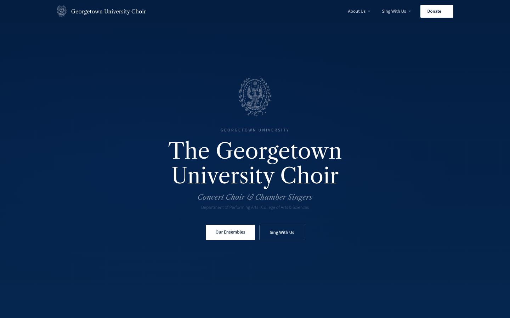

# Georgetown University Choir



**Live site:** [georgetownchoir.org](https://www.georgetownchoir.org/)

The official website for the **Georgetown University Concert Choir** and
**Chamber Singers**, part of the Department of Performing Arts. The site
covers both ensembles, drives students to the audition sign-up funnel each
semester, and routes donors to Georgetown University Advancement to support
either group.

Maintained by the choir's student leadership (Co-President) on behalf of the
Director of Vocal Studies.

## Stack

- **Static HTML, CSS, and vanilla JS** — a single `index.html` with an inline
  `<style>` block and one small inline `<script>`. No framework, no build
  step, no package manager.
- **[Google Fonts](https://fonts.google.com/)** (Libre Caslon Text, Source
  Sans 3), loaded via `<link>`.
- **[Vercel](https://vercel.com/)** for hosting, deploying straight from this
  repo's `main` branch with the custom domain `georgetownchoir.org` attached.

This is deliberately the simplest stack that works: the site is a handful of
sections that rarely change (audition dates, donation links, a video embed),
maintained by a rotating cast of student officers rather than a dedicated
engineering team. A static single file needs no dependencies to go stale, no
build pipeline to break, and no hosting bill — anyone can open it in a text
editor and understand the whole site.

## Notable implementation details

- **Responsive nav.** A fixed top nav with hover-triggered dropdowns
  (`About Us`, `Sing With Us`, `Donate`) collapses under 900px into a
  hamburger-triggered full-screen menu, toggled by a single `classList.toggle`
  call.
- **Audition signup funnel.** The `#auditions` band walks a prospective
  member through the process in three steps and links out to two separate
  [SignUpGenius](https://www.signupgenius.com/) forms — one for the initial
  voice placement session, one for the Chamber Singers audition slot itself.
  The same two links are repeated in the nav dropdown, the mobile menu, and
  the footer.
- **Dual ensemble-specific donation routing.** "Donate" isn't one link — the
  nav dropdown, the ensemble cards, and the `#donate` section each link to
  Georgetown Advancement's giving form with ensemble-specific query
  parameters (`dids`, `appealcode`) baked in, so a gift made from the Concert
  Choir button and one made from the Chamber Singers button post to different
  designations and appeal codes on Advancement's side.
- **YouTube embed.** An `<iframe>` embed in the "Watch & Listen" section,
  wrapped in a padding-based aspect-ratio box so it stays 16:9 responsively.
- **Newsletter capture.** A "Stay Connected" email input + subscribe button
  in the `.mail` section. It's currently presentational only — see
  [Known issues](#known-issues-worth-fixing-before-a-senior-engineer-reads-this).
- **Scroll-reveal animation.** An `IntersectionObserver` (the only JS besides
  the nav toggle) adds a `.visible` class to `.reveal` elements as they enter
  the viewport, driving a simple fade/slide-up transition.

## Local development

There's no build step. To work on the site:

```bash
git clone https://github.com/stephenyupa/georgetown-choir.git
cd georgetown-choir
python3 -m http.server 8000
# open http://localhost:8000
```

Or just open `index.html` directly in a browser — everything except the
Google Fonts request works offline.

## Deploying

Vercel is connected directly to this GitHub repo. Pushing to `main` triggers
an automatic production deploy to `georgetownchoir.org` — there's no separate
deploy command or CI step to run.

## Known issues worth fixing before a senior engineer reads this

- **Several nav items are dead anchors (`href="#"`).** They don't 404, they
  just don't go anywhere and silently scroll to the top of the page:
  - Nav logo / "home" link
  - "About Us" dropdown trigger, plus its "Our Story" and "Artistic
    Leadership" items
  - "Rehearsal Schedule" and "Sponsor a Concert" dropdown items
  - Mobile menu's "Our Story" and "Artistic Leadership"
  - Footer "About" column: "Our Story," "Leadership," "Concert Choir," and
    "Chamber Singers"
- **The newsletter signup doesn't do anything.** The "Subscribe" button isn't
  inside a `<form>`, has no `action`/`method`, and there's no JS handling the
  click — it's markup with no backend or ESP (Mailchimp, etc.) wired in.
- **The university seal is embedded as a base64 data URI three separate
  times** (nav, hero, footer) — the same ~70KB image inlined three times
  instead of referenced once as a static file, which is most of why a
  single-page site weighs in at 340KB+. The faculty photo is base64-inlined
  the same way. These should be extracted to `/assets` and referenced by
  path, both for page weight and so the browser can cache them once.
- **Donation and SignUpGenius links are hardcoded and duplicated 4+ times
  each** across the nav, mobile menu, ensemble cards, and footer, rather than
  defined once. If Advancement ever reissues an appeal code or SignUpGenius
  URL, that's four-plus manual find-and-replaces with no single source of
  truth, and an easy way for one stale link to slip through.
- **Dropdown menus are hover-only.** `.ni:hover .dd` means the "About Us,"
  "Sing With Us," and "Donate" submenus are unreachable by keyboard — there's
  no focus-visible state, so a keyboard or switch-device user can't open them
  at all.
- **The hamburger button has no accessible name or state.** No
  `aria-label`, `aria-expanded`, or `aria-controls` on the `.ham` button, so
  a screen reader announces an unlabeled button with no indication it
  opens a menu.
- **Several text elements fail contrast minimums** against the dark blue
  background — e.g. `.hero-dept` at `rgba(255,255,255,0.28)` and
  `.ft-credit` at `rgba(255,255,255,0.2)` are both well under WCAG AA's
  4.5:1 for body text.
- **No Open Graph or Twitter Card meta tags**, so links shared in Slack,
  iMessage, or social media render with no preview image or description.
  There's also no favicon and no canonical URL.
- **Gallery and ensemble photos are hotlinked from
  `performingarts.georgetown.edu`**, a different department's WordPress
  site this repo doesn't control — if those get moved, renamed, or the
  department redesigns, images break here with no warning.
- **The footer copyright year (`© 2026`) and the Fall 2026 audition dates
  are hand-typed into the markup**, not derived or config-driven, so both
  will silently go stale until someone remembers to edit them by hand.
